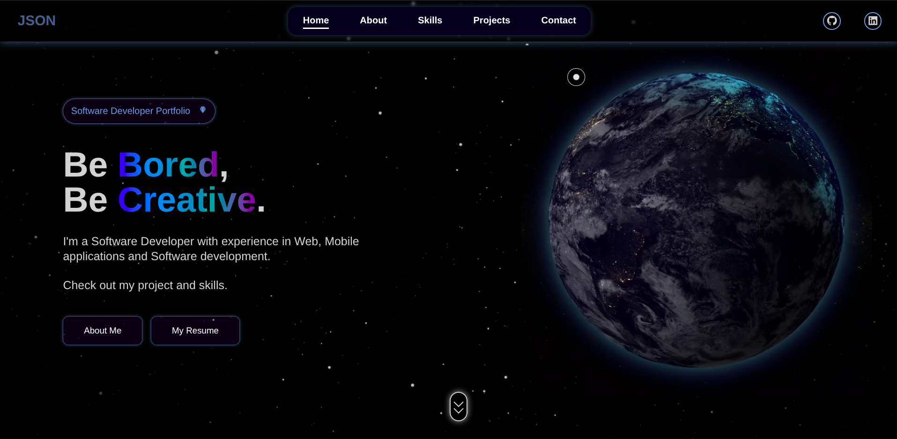

# My Portfolio Project

This repository holds the source code for my portfolio website.  
I built this project from scratch to create an interactive and modern showcase for my skills, projects, and to connect with others in the tech community.  

My goal was to build an engaging and memorable experience using the core web technologies that I'm passionate about, without relying on external frameworks. 

<p align="center">
  
</p>

---

## 🔥 Key Features & Technical Highlights

### Custom CSS Animation Engine
Initially, I used GSAP for animations, but I challenged myself to convert everything to pure CSS for a fully offline-capable site.  
This includes the initial loading sequence and the smooth, cascading entrance of the hero section.

### Fully Responsive Layout
The design adapts seamlessly from a full desktop view to a mobile-friendly sidebar, ensuring a great experience on any device (Mobile, Tab, Desktop).

### "Scrollspy" Active Navigation
One of my favorite features. As you scroll, the navigation link for the current section automatically highlights.  
This was a fun challenge to perfect, especially for sections with different heights on mobile.  
The final version uses an **IntersectionObserver** with a custom `rootMargin` to create a precise "activation zone" in the middle of the screen.

### Interactive UI
Little details like the custom cursor on desktop, the scroll-to-top button, and subtle hover effects were added to make the site more engaging.

### Working Contact Form
The contact form is fully functional.  
It uses asynchronous JavaScript to send the message via **Formspree** and then displays a success message right on the page, without needing a redirect.

---

## 🛠️ Tech Stack

- **HTML5**: The backbone and structure  
- **CSS3**: For styling, layout (Flexbox + Grid), and the animation engine  
- **JavaScript (ES6)**: For interactive features like IntersectionObservers and the contact form  

---

## 🚀 Running the Project Locally

If you'd like to explore the project on your own machine, it's very simple:

>#### Clone this repository
```bash
git clone https://github.com/Surya-Kaliappan/portfolio.git 
```

>#### Navigate into the folder
```bash
cd portfolio
```

Then, just open the `index.html` file in your browser.

## 🙌 Final Note

That’s all there is to it! 🎉  
Feel free to explore the code and see how it all works.

✨ **Thanks for checking out my project!**
